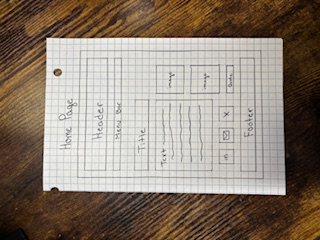
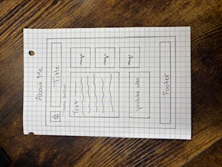
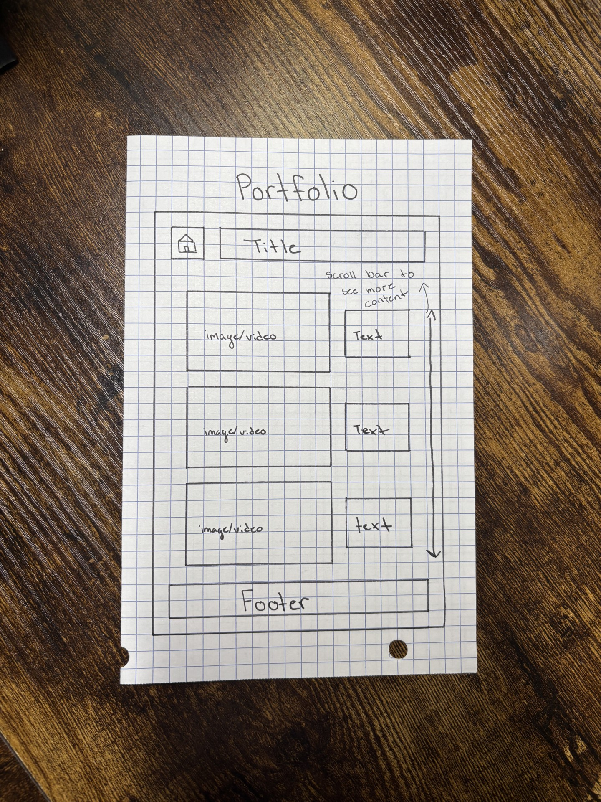

# Kaleigh Webber's INF 6420 Project 

A portfolio showcasing my work. 

## Wireframes

To help plan I have created some wirefreames to show the what site architecture and layout could possibly be. 

Header - will include my name. The menu bar will be directly below. 

Menu Bar - will include links to other pages like About Me and Portfolio. 

Main Content - will give a breif introduction myself with some pictures on the right-hend side of the text. 

Social Media Icon - will link to my social media pages. 

Footer - will include additional contact information and copyright information. 

Home Button - will link to Home Page 

Header - will include the title of the page. 

Main Content - will include more detailed information about myself with inmages on the right-hand side and a youtube video embedded below the text. 

Footer - will include additional contact information and copyright information. 

Home Button - will link to Home Page 

Header - will include title of the page. 

Content - will include inmages or videos of my work with text descriptions on the right-hand side. 

Footer - will include additional contact information and copyright information. 

